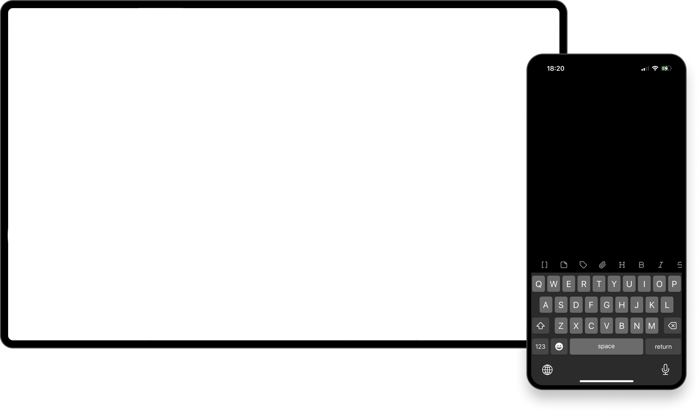
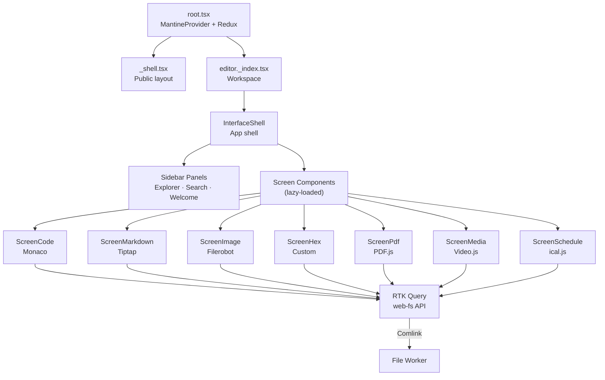
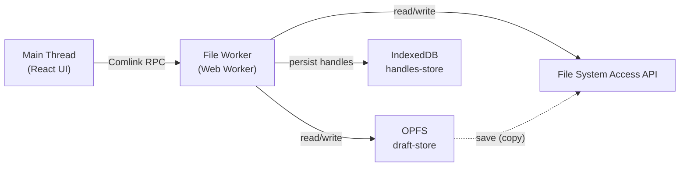

# dysumi

A local-first, browser-native file editor. Open, edit, and manage files entirely in your browser — no server uploads, no accounts required.

Built on the [File System Access API](https://developer.mozilla.org/en-US/docs/Web/API/File_System_API) and [OPFS](https://developer.mozilla.org/en-US/docs/Web/API/File_System_API/Origin_private_file_system), dysumi provides a VS Code–inspired workspace with dedicated editors for Markdown, source code, images, PDFs, calendars, media, hex data, and more.



## Features

| Format | Editor | Library |
|---|---|---|
| `.md` `.mdx` | Rich-text Markdown (WYSIWYG) | [Tiptap](https://tiptap.dev) + KaTeX |
| Source code | Monaco code editor | [Monaco Editor](https://microsoft.github.io/monaco-editor/) |
| `.csv` `.tsv` | Tabular spreadsheet | [Handsontable](https://handsontable.com) |
| `.ics` `.vcs` | Calendar / event wizard | [ical.js](https://github.com/kewisch/ical.js) |
| `.jpg` `.png` `.webp` `.svg` … | Image editor | [Filerobot](https://github.com/scaleflex/filerobot-image-editor) |
| `.pdf` | PDF viewer | [PDF.js](https://mozilla.github.io/pdf.js/) |
| `.mp4` `.mp3` `.webm` … | Media player + visualizer | [Video.js](https://videojs.com) + [Butterchurn](https://github.com/jberg/butterchurn) |
| `.bmp` | MS Paint 🎉 | [jspaint.app](https://jspaint.app) + Clippy |
| `.bin` `.dat` `.exe` … | Hex viewer with data inspector | Custom virtualized grid |

**Workspace:** sidebar panels, resizable panes, tabbed files, drag-and-drop file tree ([dnd-kit](https://dndkit.com)), dark/light theme, navigation progress bar.

## Architecture



### Storage

All file I/O runs in a [Web Worker](https://developer.mozilla.org/en-US/docs/Web/API/Web_Workers_API) via [Comlink](https://github.com/GoogleChromeLabs/comlink) with a file-lock mechanism to prevent concurrent writes.



- **Edits** write to OPFS (`draft-store`) — instant saves, no permission prompts
- **Save** copies from OPFS → File System Access API (user-granted handle)
- **Dirty state** detected by whether an OPFS draft exists for a given path

## Tech Stack

| Layer | Technology |
|---|---|
| Framework | [React](https://react.dev) 19 · [React Router](https://reactrouter.com) 7 (SPA, pre-rendered) |
| UI | [Mantine](https://mantine.dev) 9 |
| State | [Redux Toolkit](https://redux-toolkit.js.org) + RTK Query |
| Build | [Vite](https://vite.dev) 8 |
| Language | [TypeScript](https://www.typescriptlang.org) 6 (strict) |
| Lint / Format | [Biome](https://biomejs.dev) 2 |
| Styling | SCSS Modules · PostCSS (Mantine preset) |
| Workers | [Comlink](https://github.com/GoogleChromeLabs/comlink) |

## Getting Started

```bash
yarn install   # install dependencies
yarn dev       # start dev server
yarn typecheck # type-check (generates route types + runs tsc)
yarn build     # production build
yarn start     # serve production build
```

## Project Structure

```
src/
├── components/
│   ├── DirectoryTree/     # File explorer tree (drag-and-drop)
│   ├── InterfaceShell/    # App shell (navbar, panels, status bar)
│   ├── Panel*/            # Sidebar panels (Explorer, Search, Welcome)
│   └── Screen*/           # File-type screens (Code, Markdown, Image, …)
├── lib/
│   ├── redux/             # Store, slices, RTK Query (web-fs API)
│   ├── ui/                # Editor*/Viewer* components
│   ├── utils/             # ICS parser, client boundary helper
│   └── workers/           # File Worker (Web Worker)
├── routes/                # File-based routes
└── root.tsx               # App root
```

## Keyboard Shortcuts

| Shortcut | Action |
|---|---|
| `Ctrl+S` | Save current file |
| `Ctrl+Shift+S` | Save as… |
| `Ctrl+O` | Open file / folder |
| `Ctrl+N` | New file |
| `Ctrl+F` | Find in file |

## License

[AGPL-3.0-only](LICENSE)
